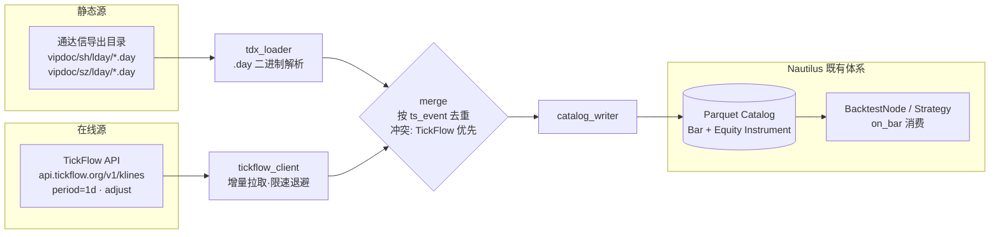

# A股双源数据架构（A-Stock Data Architecture）

> 变更提案：a-stock-data-integration · 架构定位：**数据准备层**（复用既有 catalog 体系，不动内核）



## 设计决策

| # | 决策 | 理由 |
|---|---|---|
| D1 | **catalog 为汇聚点**，不做独立数据库 | 复用 persistence 体系；回测引擎原生消费 |
| D2 | 解析器放在 **adapters/astock**（Python 侧） | 数据准备属控制面；TDX 文件格式简单，无需 Rust 性能 |
| D3 | 冲突时 **TickFlow 优先** | 在线源含除权因子与更正数据；静态导出可能过期 |
| D4 | **不实现 DataClient 端口**（首期） | 非实盘订阅，是离线数据准备；后续实盘化时再按 D-03 端口规范实现 |
| D5 | `.day` 解析 **零第三方依赖** | 格式固定 32 字节/记录：date/open/high/low/close/amount/vol/reserved |

## TDX `.day` 记录布局（通行格式，实现时以实际文件校准）

```
每记录 32 字节（小端）：
  0x00 u32 date        YYYYMMDD
  0x04 u32 open        分（÷100 得元）
  0x08 u32 high        分
  0x0C u32 low         分
  0x10 u32 close       分
  0x14 f32 amount      成交额（元）
  0x18 u32 vol         成交量（股）
  0x1C u32 reserved
```

## TickFlow 映射

| TickFlow | Nautilus |
|---|---|
| `symbol=600000.SH` | `InstrumentId("600000", "SH")` → venue `SH` |
| `period=1d` | `BarSpecification(1, DAY, LAST)` + EXTERNAL |
| `open/high/low/close`（元） | `Price(x, precision=2)` |
| `volume`（股） | `Quantity(x, precision=0)` |
| 时间戳（ms） | `UnixNanos`（×1e6，`ts_event`=收盘时刻约定） |

## 验收锚点

对应 test/astock/astock-test-cases.md 的 UT-AST-* 与 ST-A1/A2。
