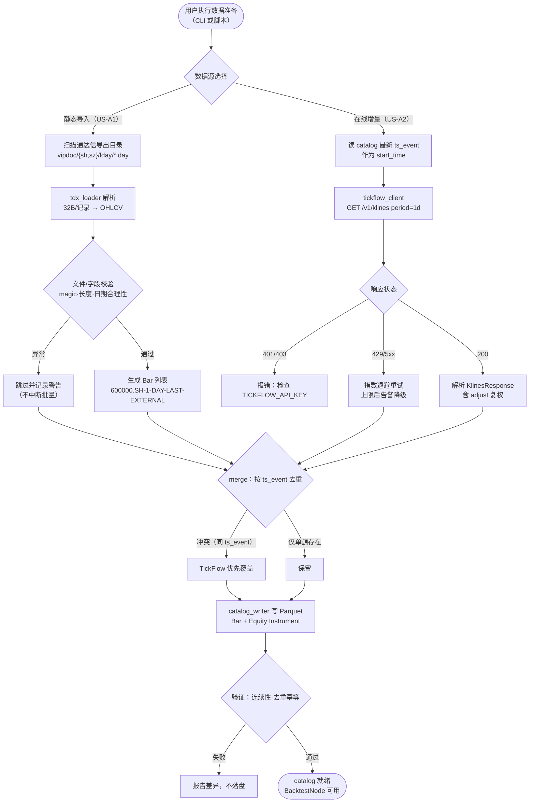

# D-10 · A股双源数据流（处理流程图）

> 变更提案：a-stock-data-integration

```mermaid
flowchart TB
    START(["用户执行数据准备<br/>（CLI 或脚本）"]) --> SRC{"数据源选择"}

    SRC -- "静态导入（US-A1）" --> T1["扫描通达信导出目录<br/>vipdoc/{sh,sz}/lday/*.day"]
    T1 --> T2["tdx_loader 解析<br/>32B/记录 → OHLCV"]
    T2 --> T3{"文件/字段校验<br/>magic·长度·日期合理性"}
    T3 -- "异常" --> T4["跳过并记录警告<br/>（不中断批量）"]
    T3 -- "通过" --> T5["生成 Bar 列表<br/>600000.SH-1-DAY-LAST-EXTERNAL"]

    SRC -- "在线增量（US-A2）" --> F1["读 catalog 最新 ts_event<br/>作为 start_time"]
    F1 --> F2["tickflow_client<br/>GET /v1/klines period=1d"]
    F2 --> F3{"响应状态"}
    F3 -- "401/403" --> F4["报错：检查 TICKFLOW_API_KEY"]
    F3 -- "429/5xx" --> F5["指数退避重试<br/>上限后告警降级"]
    F3 -- "200" --> F6["解析 KlinesResponse<br/>含 adjust 复权"]

    T5 --> M{"merge：按 ts_event 去重"}
    F6 --> M
    M -- "冲突（同 ts_event）" --> MP["TickFlow 优先覆盖"]
    M -- "仅单源存在" --> KEEP["保留"]
    MP --> W
    KEEP --> W["catalog_writer 写 Parquet<br/>Bar + Equity Instrument"]
    T4 --> M
    F5 --> M

    W --> V{"验证：连续性·去重幂等"}
    V -- "失败" --> VR["报告差异，不落盘"]
    V -- "通过" --> OK(["catalog 就绪<br/>BacktestNode 可用"])
```

**不变量**
- 合并幂等：同数据集重复执行，catalog 内容不变（NFR-A4）
- 单源故障不阻塞另一源（NFR-A2：TickFlow 失败时通达信数据仍可入库）
- 时间戳遵循 bar 收盘时刻约定（防未来函数，见 bar.md）
