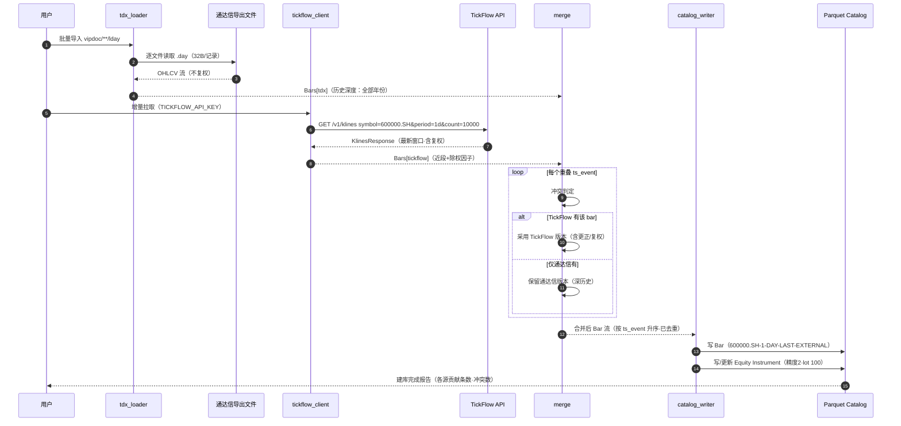

# D-11 · 双源合并时序（时序图）

> 变更提案：a-stock-data-integration · 首次全量建库场景

```mermaid
sequenceDiagram
    autonumber
    participant U as 用户
    participant TL as tdx_loader
    participant FS as 通达信导出文件
    participant TC as tickflow_client
    participant API as TickFlow API
    participant MG as merge
    participant CW as catalog_writer
    participant CAT as Parquet Catalog

    U->>TL: 批量导入 vipdoc/**/lday
    TL->>FS: 逐文件读取 .day（32B/记录）
    FS-->>TL: OHLCV 流（不复权）
    TL-->>MG: Bars[tdx]（历史深度：全部年份）

    U->>TC: 增量拉取（TICKFLOW_API_KEY）
    TC->>API: GET /v1/klines symbol=600000.SH&period=1d&count=10000
    API-->>TC: KlinesResponse（最新窗口·含复权）
    TC-->>MG: Bars[tickflow]（近段+除权因子）

    loop 每个重叠 ts_event
        MG->>MG: 冲突判定
        alt TickFlow 有该 bar
            MG->>MG: 采用 TickFlow 版本（含更正/复权）
        else 仅通达信有
            MG->>MG: 保留通达信版本（深历史）
        end
    end

    MG-->>CW: 合并后 Bar 流（按 ts_event 升序·已去重）
    CW->>CAT: 写 Bar（600000.SH-1-DAY-LAST-EXTERNAL）
    CW->>CAT: 写/更新 Equity Instrument（精度2·lot 100）
    CAT-->>U: 建库完成报告（各源贡献条数·冲突数）
```

**后续每日维护（US-A2）**：仅执行右半链路——
catalog 最新 ts_event → TickFlow `start_time` 增量 → merge（新 ts_event 直接入库）→ 完成。
通达信文件仅在人工下载新导出后重跑左半链路。
