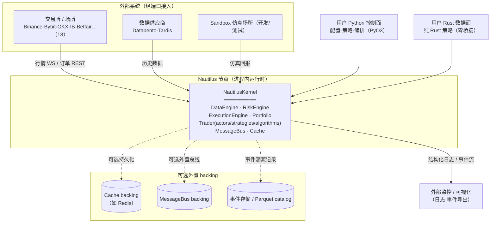

# D-01 · 系统上下文（总图）

> 系统边界 = 一个 Nautilus 节点实例运行时。外部系统经适配器端口接入。

```mermaid
flowchart TB
    subgraph EXT["外部系统（经端口接入）"]
        VEN["交易所 / 场所<br/>Binance·Bybit·OKX·IB·Betfair…（18）"]
        DVP["数据供应商<br/>Databento·Tardis"]
        SDB["Sandbox 仿真场所（开发/测试）"]
    end

    subgraph NODE["Nautilus 节点（进程内运行时）"]
        KERNEL["NautilusKernel<br/>━━━━━━━━━━<br/>DataEngine · RiskEngine<br/>ExecutionEngine · Portfolio<br/>Trader(actors/strategies/algorithms)<br/>MessageBus · Cache"]
    end

    subgraph OPT["可选外置 backing"]
        CB[("Cache backing<br/>（如 Redis）")]
        BB[("MessageBus backing")]
        FS[("事件存储 / Parquet catalog")]
    end

    USER_PY["用户 Python 控制面<br/>配置·策略·编排（PyO3）"]
    USER_RS["用户 Rust 数据面<br/>纯 Rust 策略（零桥接）"]
    MON["外部监控 / 可视化<br/>（日志·事件导出）"]

    VEN -- "行情 WS / 订单 REST" --> KERNEL
    DVP -- "历史数据" --> KERNEL
    SDB -- "仿真回报" --> KERNEL

    USER_PY --> KERNEL
    USER_RS --> KERNEL

    KERNEL -. "可选持久化" .-> CB
    KERNEL -. "可选外置总线" .-> BB
    KERNEL -. "事件溯源记录" .-> FS
    KERNEL -- "结构化日志 / 事件流" --> MON
```

**要点**
- 一个节点 = 一个进程，无服务化拆分；多场所并发在进程内由适配器承载
- backing（Cache/Bus）与事件存储均为**可选**外置，最小部署零依赖
- 用户有两个语言面：Python 控制面（默认）与纯 Rust 路径（US-010）
