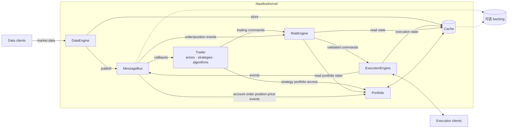

# D-02 · 内核六组件架构（分图）

> 真相源：docs/concepts/architecture.md 系统架构图（组件连接关系为官方原文）

**组件职责速查**

| 组件 | crate | 单一职责 |
|---|---|---|
| DataEngine | data | 行情订阅/请求/发布、历史回放、自定义数据注册 |
| RiskEngine | risk | TradingCommand 预检（额度/价格/频率），读 Cache+Portfolio |
| ExecutionEngine | execution | 命令下发适配器；执行事件回写 Cache、上总线 |
| Portfolio | portfolio | 消费四类事件，增量核算账户/仓位/盈亏 |
| Trader | trading | Actor/Strategy/Algorithm 容器与生命周期 |
| MessageBus | common | 进程内消息中枢：pub/sub、req/resp、p2p |
| Cache | common/model | 状态存储，可外置 backing |

**读图关键**：命令流向单向链 `Trader → RiskEngine → ExecutionEngine`（预检前置）；
事件流向经 MessageBus 扇出到 RiskEngine/Portfolio/Trader（状态回流闭环）。
