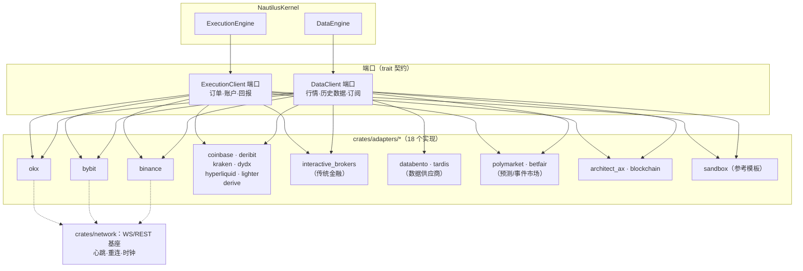

# D-03 · 端口与适配器架构（分图）

> 六边形架构：内核不认识任何具体场所，只认识两个端口。

**要点**
- DataEngine 只依赖 `DataClient` trait、ExecutionEngine 只依赖 `ExecutionClient` trait——新增场所零内核改动（FR-013）
- `sandbox` 是官方参考实现：新适配器贡献者（P4）从它起步
- databento/tardis 仅实现 Data 侧（历史数据），不下单——图中 EP 无连线
- 适配器统一走 network 基座获得心跳/重连能力（FR-010）
