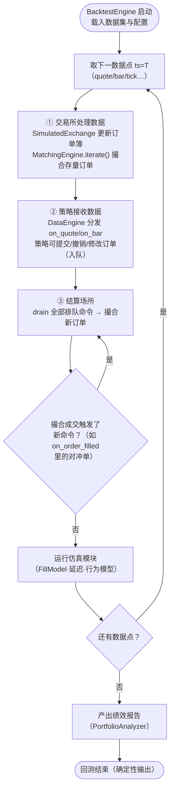

# D-04 · 回测主循环（处理流程图）

> 真相源：docs/concepts/backtesting/execution-flow.md —— 官方"每数据点三阶段"循环

**关键不变量**
- **同一时间戳内级联结算**：对冲链在同 T 内全部撮合完成，不留跨时间戳悬单
- **数据先于回调**：市场状态更新 → 才轮到策略——避免策略看到过期簿
- **确定性**：无墙钟、无随机源（除非显式种子），同输入必同输出（NFR-003）
