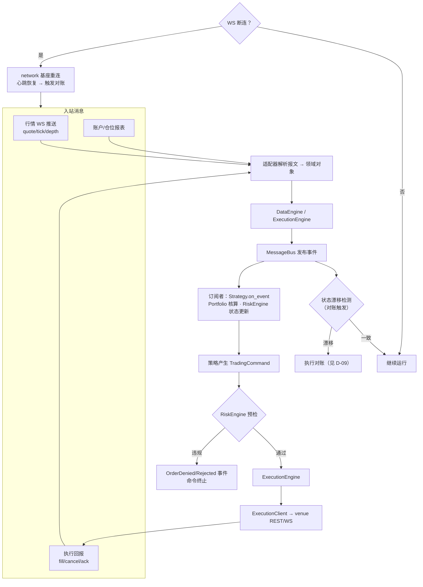

# D-05 · 实盘消息处理（处理流程图）

> 与回测同构，差异仅在：真实客户端 + 实时钟 + 增加对账与重连分支。

```mermaid
flowchart TB
    subgraph IN["入站消息"]
        MD["行情 WS 推送<br/>quote/tick/depth"]
        ER["执行回报<br/>fill/cancel/ack"]
        AR["账户/仓位报表"]
    end

    MD --> PARSE["适配器解析报文 → 领域对象"]
    ER --> PARSE
    AR --> PARSE
    PARSE --> DE["DataEngine / ExecutionEngine"]
    DE --> BUS["MessageBus 发布事件"]
    BUS --> SUB["订阅者：Strategy.on_event<br/>Portfolio 核算 · RiskEngine 状态更新"]

    SUB --> CMD["策略产生 TradingCommand"]
    CMD --> RISK{"RiskEngine 预检"}
    RISK -- "违规" --> DENY["OrderDenied/Rejected 事件<br/>命令终止"]
    RISK -- "通过" --> EXEC["ExecutionEngine"]
    EXEC --> SEND["ExecutionClient → venue REST/WS"]
    SEND --> ER

    BUS --> OMS{"状态漂移检测<br/>（对账触发）"}
    OMS -- "漂移" --> RECON["执行对账（见 D-09）"]
    OMS -- "一致" --> IDLE["继续运行"]

    CONN{"WS 断连？"}
    CONN -- "是" --> RETRY["network 基座重连<br/>心跳恢复 → 触发对账"]
    RETRY --> IN
    CONN -- "否" --> IDLE
```

**要点**
- 命令路径与回测完全一致（RiskEngine 前置预检）——FR-002 同构性的实盘侧体现
- 重连与对账是实盘独有分支：网络恢复后先对齐状态再继续交易
- 全链路事件可序列化导出（供审计与监控）
