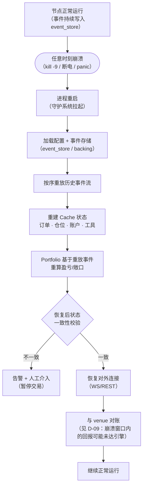

# D-06 · 崩溃恢复（处理流程图）

> Crash-only 设计：无优雅停机路径，恢复 = 事件重放重建状态。

**关键设计**
- **无停机协议**：不实现"优雅关闭"特殊路径——崩溃即常态，任何时刻可恢复（NFR-004）
- **事件溯源为唯一真相**：状态可全量由事件导出，Cache 只是投影
- **恢复后必对账**：崩溃窗口内 venue 侧成交可能未送达，重放不覆盖该缺口，靠对账补齐
