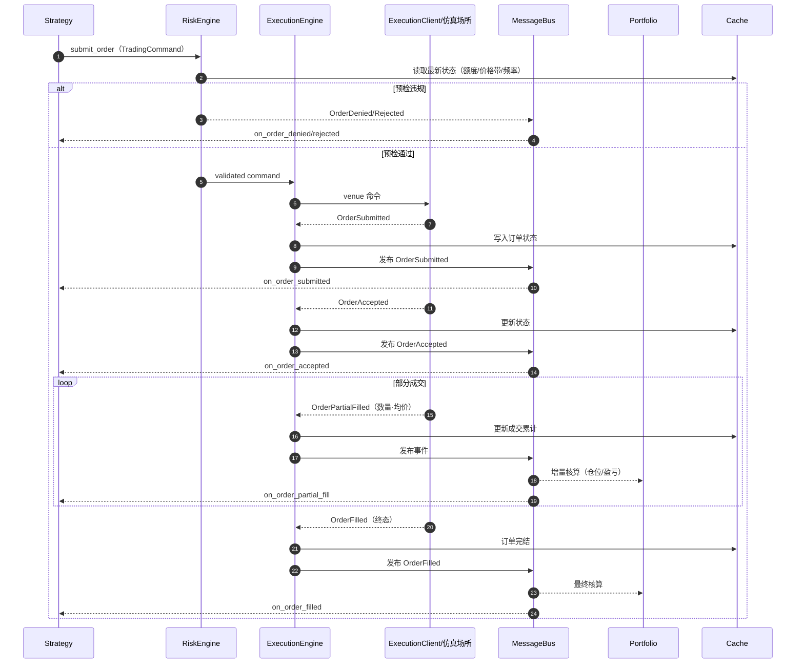

# D-07 · 时序：订单全生命周期

> 一笔限价单从策略提交到终态的完整消息时间线（回测与实盘同构路径）。

**终态全集**：Filled · Rejected · Canceled · Expired · Updated（修改后继续）· Denied。
订单类型（12 种）：market · limit · stop_market · stop_limit · market_to_limit ·
market_if_touched · limit_if_touched · trailing_stop_market · trailing_stop_limit · emulated · advanced。
