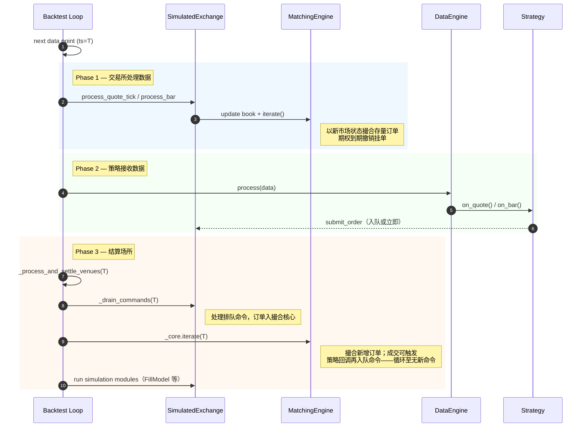

# D-08 · 时序：回测逐数据点处理

> 真相源：docs/concepts/backtesting/execution-flow.md 官方 sequenceDiagram（成分对齐原文）。

```mermaid
sequenceDiagram
    autonumber
    participant BL as Backtest Loop
    participant Exch as SimulatedExchange
    participant ME as MatchingEngine
    participant DE as DataEngine
    participant Stgy as Strategy

    BL->>BL: next data point (ts=T)

    rect rgb(240, 248, 255)
    note right of BL: Phase 1 — 交易所处理数据
    BL->>Exch: process_quote_tick / process_bar
    Exch->>ME: update book + iterate()
    note right of ME: 以新市场状态撮合存量订单<br/>期权到期撤销挂单
    end

    rect rgb(245, 255, 245)
    note right of BL: Phase 2 — 策略接收数据
    BL->>DE: process(data)
    DE->>Stgy: on_quote() / on_bar()
    Stgy-->>Exch: submit_order（入队或立即）
    end

    rect rgb(255, 248, 240)
    note right of BL: Phase 3 — 结算场所
    BL->>BL: _process_and_settle_venues(T)
    BL->>Exch: _drain_commands(T)
    note right of Exch: 处理排队命令，订单入撮合核心
    BL->>ME: _core.iterate(T)
    note right of ME: 撮合新增订单；成交可触发<br/>策略回调再入队命令——循环至无新命令
    BL->>Exch: run simulation modules（FillModel 等）
    end
```

**与 D-04 的关系**：D-04 是控制流视角（含级联循环判定），本图是参与方消息视角——两者互为印证。
