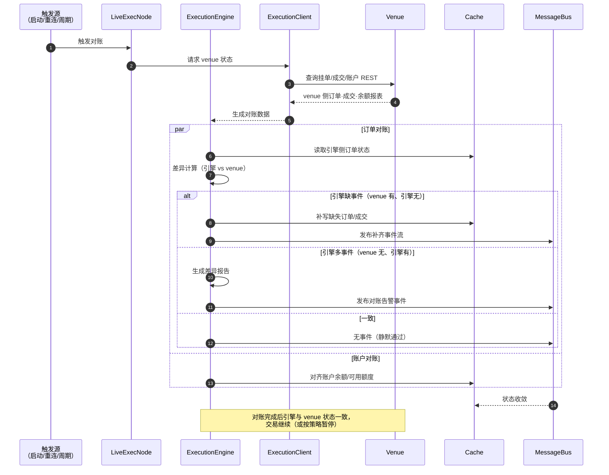

# D-09 · 时序：实盘对账（Reconciliation）

> 真相源：docs/concepts（live/execution 的 reconciliation 概念，官方文档高频主题）。
> 对齐引擎状态与 venue 真实状态，消除漂移。

**触发时机**
- 节点启动/崩溃恢复后（D-06 的收尾步骤）
- WS 重连成功后
- 周期性巡检（可配置）

**对账是对崩溃恢复的必要补充**：事件重放只能重建"引擎已见"的状态，
崩溃窗口内 venue 侧发生的变化必须靠对账拉齐。
