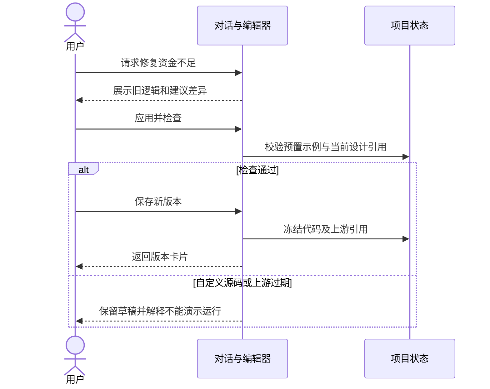

## MODIFIED — 策略开发工作区设计

# 策略开发工作区设计

## S16 策略开发工作区
开发区合并进统一工作区，S16 与 S18 共用一个源码草稿与版本库。对话可打开开发区、提出修复，编辑器可以直接修改与下载源码。

## 布局与交互
顶部显示检查状态与选中版本；主体为等宽编辑器；下方是修复差异、版本历史和检查结果。修复操作先展示差异，再由用户应用；检查只接受完整匹配的两份预置示例，任意其他源码可编辑但不能运行。保存版本冻结需求、设计、资源和代码，草稿后续编辑不覆盖历史版本。

## 场景时序

## 生产边界
Python 仅为示例文本，不构成运行时选型承诺；原型检查不是编译或策略行为测试。检查用例见 S18，运行与事件计算见 S19。
