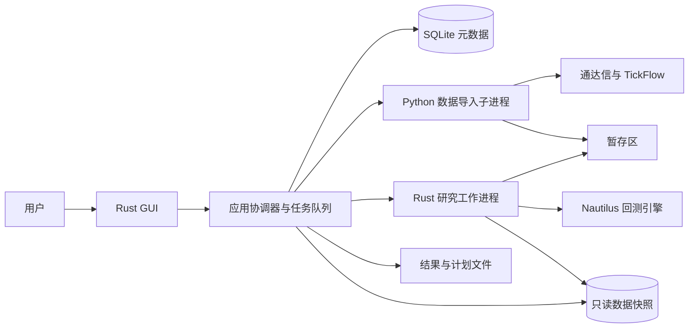

## ADDED — 架构决策
采用 egui＋eframe 的原生 Rust GUI，图表采用 egui_plot，SQLite 保存研究元数据，Parquet 保存行情与大结果。GUI 不调用交易执行通道。Rust 研究工作进程直接复用 nautilus-backtest／model／indicators／analysis；Python 子进程仅封装现有 A 股数据适配器，协议化输出暂存数据。
选择依据：eframe 官方明确支持 Windows／Linux，egui_plot 提供二维图表；该组合适合本工具的表格、参数编辑和研究曲线。Iced 的 update/view 状态模型也可用，但本期统一采用 egui 体系以避免同时维护两套控件抽象。这里是项目设计判断，不是性能测评结论。锁定依赖版本须在实现首批验证仓库 Rust 1.98.1 工具链与双平台编译后写入 Cargo.lock，禁止跟随 main 构建发布包。
参考：[eframe](https://github.com/emilk/egui/blob/main/crates/eframe/README.md)、[egui_plot](https://github.com/emilk/egui_plot)、[Iced application](https://docs.rs/iced/latest/iced/application/index.html)，核验于2026-09-29。

## ADDED — 组件与进程

建议新增 crates/research-desktop、crates/research-domain、crates/research-worker；Python 桥接置于现有 adapters/astock 下独立入口。协调器属于桌面应用后台，单独工作线程持有数据库写连接；GUI 只发类型化消息、接收不可变视图。引擎含 Rc/RefCell，见 crates/backtest/src/engine.rs，必须在工作进程的同一线程创建、使用和销毁，不能假设引擎可 Send。
Rust 工作进程负责筛选、信号、撮合编排、结果聚合及计划生成；Python 不重复实现策略计算。工作进程以 stdin/stdout JSONL 通信，日志只写 stderr，GUI 不直接解析 stdout；读管道线程与计算线程分离，通过原子取消标记在日批次边界响应取消。不得跨线程搬移引擎对象。

## ADDED — 任务与提交协议
状态：queued→running→succeeded/failed/cancelled；running→cancelling→cancelled，异常退出→interrupted；终态不可回退。cancel 与完成竞争时，以协调器已持久化的完成事务为准；已完成返回 ALREADY_TERMINAL，不删除结果。取消先发控制消息，5秒未响应终止该任务进程，完整等待退出后落 cancelled，不杀其他进程。
每任务只有一个 UUID task_id 和单调 event_seq；请求 idempotency_key 与规范化请求哈希绑定，重试相同键返回原任务，不同载荷返回冲突。参数网格父任务保留已完成子结果，取消只影响未完成项；重试创建新任务并关联 retry_of，不把旧终态改成运行中。
工作进程写私有临时目录，结束先同步文件并生成哈希清单；协调器校验清单、同卷原子重命名到只读内容目录，再事务提交元数据与终态。文件提交成功但事务失败产生孤儿文件，下次清理；元数据提交前任何读者都不可见。不得宣称 SQLite 事务同时覆盖文件系统。
启动扫描非终态任务标为 interrupted，提供“重新运行”；不承诺中途断点续算。SQLite 只允许协调器写入，busy 超时3秒后返回可重试错误。数据库事务依据 [SQLite 事务文档](https://www.sqlite.org/lang_transaction.html)。工作区锁拒绝第二个写实例，不支持网络共享盘作为活跃工作区。

## ADDED — 数据模型与补齐入口
导入器将原始日线转换为自有 Parquet schema：instrument_id、trade_date、open/high/low/close（十进制定点）、volume_shares、amount_cny、price_basis、source、available_at、ingested_at。键为标的／交易日／价格口径；内部时间 UTC 纳秒，日期按 Asia/Shanghai 解释；交易日历不靠工作日猜测。旧 catalog 只读转换，禁止就地覆盖。
快照 manifest 固定 schema_version、分区路径和SHA256、数据源版本、区间、calendar_hash、master_hash、rules_hash、corporate_actions_hash、coverage、limitations。信号派生价用截至t可见的公司行为调整历史价格到t口径，每个时点独立处理；不得把今天回溯计算的前复权序列冒充历史当时可见数据。
现有适配器不能证明提供全部辅助字段，提供 CSV／Parquet 导入入口：证券主档含上市／退市日期和板块；状态表含有效区间／available_at／停牌／ST；财务表含 period_end／available_at／修订号／数值；公司行为含宣布时间、除权日、支付日、拆股比例、每股现金；规则表含市场／板块／有效区间／tick／最小量／步长／涨跌停规则／费用配置／来源链接。源文件由用户提供，导入时检查主键、时间范围、字段类型和冲突，不伪造供应商接口。
严格模式只对所选股票及区间所需字段完整时放行；不存在可用字段的条件在 GUI 显示“需导入辅助数据”。探索模式的限制存入快照、运行和导出，不因跨进程传递丢失。

## ADDED — 撮合接入与规则版本
工作进程按交易日推进：日初公司行为／解锁可卖库存→处理前日目标的开盘执行→收盘估值→按可见数据更新池和信号→保存次日目标。对引擎建立开盘执行事件与收盘研究事件的适配层，不能把收盘回调提交的订单交给同bar默认撮合；通过 ST-S13-01 的数值断言证明隔日执行。保留原始引擎成交、拒单与账户事件，不另建不对账的收益模拟器。
规则包按交易日生效区间解析，覆盖市场与板块差异；不完整则严格任务失败。官方当前文件仅作规则来源入口，不能反套全部历史：上交所2026修订公告标注2026-07-06生效，并列暂缓条文；必须连同暂缓条文和历史版本处理。深交所对应规则同样版本化。
来源：[上交所公告及附件](https://www.sse.com.cn/lawandrules/sselawsrules2025/stocks/exchange/c/c_20260424_10816482.shtml)、[深交所2026规则](https://docs.static.szse.cn/www/lawrules/rule/trade/current/W020260424690713155663.pdf)。本设计不附未经逐板块验真的税率／涨跌幅常量；实现需交付有来源、生效区间和测试的规则包，否则只能运行明示假设的探索样本。

## ADDED — 凭证、容量与错误
只由数据导入子进程读取 TICKFLOW_API_KEY；Rust 研究进程不继承此变量，应用日志做凭证脱敏。用户文件路径仅允许选定工作区内的内部对象，外部导入路径只读，导出通过用户选择路径；禁止通过 IPC 执行任意 shell 命令。
单条协议消息上限1MiB，数据按分区文件传递，大表查询每页≤500行，游标绑定快照哈希。图表可降采样显示但指标始终基于完整数据。磁盘空间预检，临时空间不足时失败且不提交快照。网络断开只影响更新任务；已提交研究可继续。

## ADDED — 内容哈希与精度约定
内容寻址对象只包含规范化研究内容，UTF-8、键排序、固定小数序列化；run_id、任务时间、导出路径等放在执行元数据，不能进入确定性计算哈希。相同源文件重复导入复用已登记的内容对象及原始采集记录，不因本次导入时间重写数据；修订源产生新版本并保留旧记录。
金额以十进制定点计算，现金结算到分、费用逐笔四舍五入到分；价格按规则tick取整。指标允许IEEE双精度，确定性同构建同平台结果按1e-10比较，跨平台容差1e-8；禁止以浮点字节级哈希相等作为跨平台业务正确性要求。浮点派生结果的内容哈希用于完整性检查，跨平台复现依数值容差，原始输入哈希必须一致。
业务请求去重由command_receipt统一登记，与业务保存同事务提交；异步命令在入队事务保存TaskRef。ExportPlan采用导出意图记录→写临时文件→原子替换→保存回执，崩溃恢复时校验目标哈希，未匹配则返回失败并提示重试，不能虚报导出成功。
