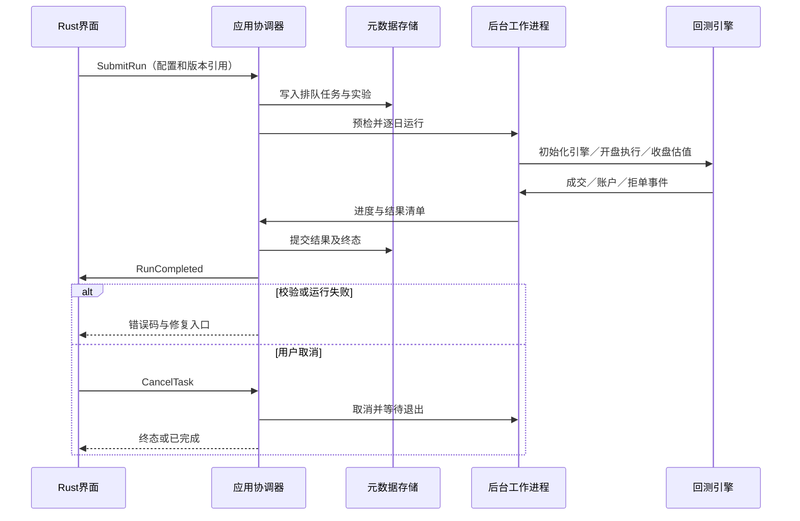
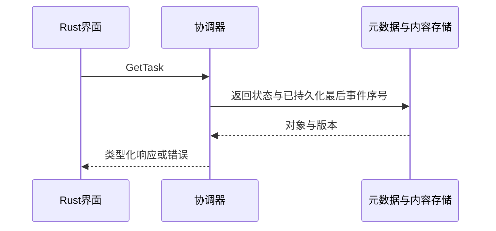

## ADDED — S13 策略研究
需求：FR-R05、FR-R06、FR-R07、FR-R10。前置：工作区已打开且持有写锁；所有引用版本存在。接口契约必须由下列消息推导。

### 场景时序

### 输入输出与后置条件
输入策略、窗口、调仓、成本／规则、区间和快照；输出 run_id、指标、逐日净值、成交、限制及版本清单。网格生成最多100个独立子运行；每个配置哈希唯一，预热不计入收益。

### 失败与取消
预检失败不启动引擎；引擎错误→failed；取消在交易日边界响应，超时终止专属工作进程；崩溃→interrupted，重试创建新run。
通用任务遵循架构状态机；写入只在最终提交后可见，页面切换不取消任务。CancelTask 只作用于尚未完成的后台任务，比较查询等同步操作返回前完成则返回 ALREADY_TERMINAL。

## ADDED — 查询与保存子流程

