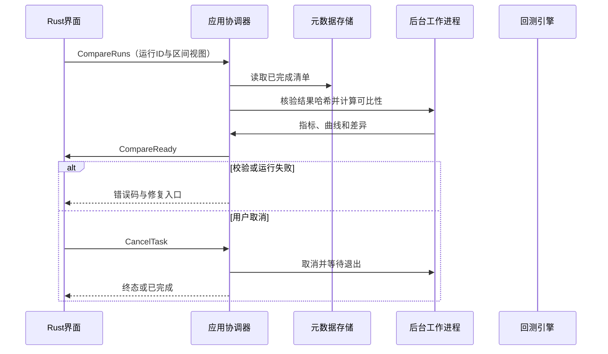
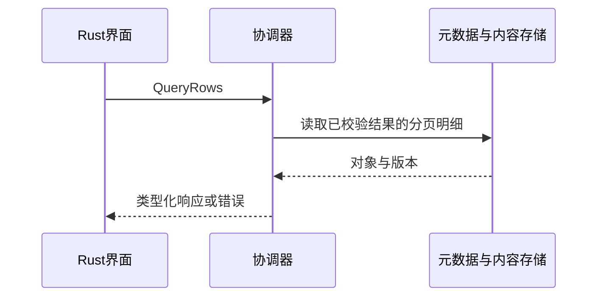

## ADDED — S14 回测比较
需求：FR-R08。前置：工作区已打开且持有写锁；所有引用版本存在。接口契约必须由下列消息推导。

### 场景时序

### 输入输出与后置条件
输入2～5个已完成run_id和完整／交集模式；输出按各自条件标注的指标与曲线，交集视图另列起止日。基准缺失保留策略指标，超额值为空。

### 失败与取消
未完成运行→RUN_NOT_READY；结果哈希异常→CORRUPT_ARTIFACT；区间无交集→NO_OVERLAP；不能静默忽略失败运行。
通用任务遵循架构状态机；写入只在最终提交后可见，页面切换不取消任务。CancelTask 只作用于尚未完成的后台任务，比较查询等同步操作返回前完成则返回 ALREADY_TERMINAL。

## ADDED — 查询与保存子流程

