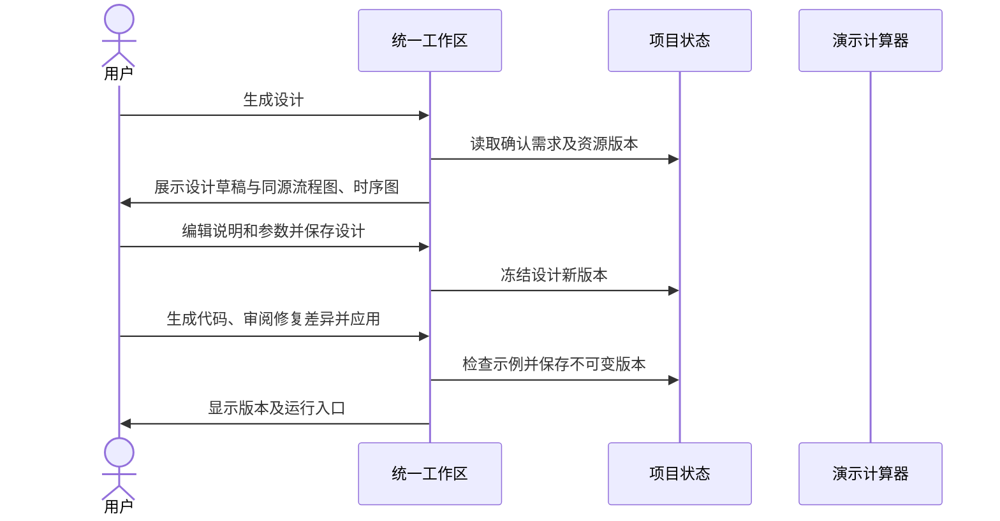

## MODIFIED — S18 处理流程到代码版本

# S18 处理流程到代码版本

## 设计图与代码版本

```mermaid
sequenceDiagram
    actor U as 用户
    participant G as 统一工作区
    participant P as 项目状态
    participant W as 演示计算器
    U->>G: 生成设计
    G->>P: 读取确认需求及资源版本
    G->>U: 展示设计草稿与同源流程图、时序图
    U->>G: 编辑说明和参数并保存设计
    G->>P: 冻结设计新版本
    U->>G: 生成代码、审阅修复差异并应用
    G->>P: 检查示例并保存不可变版本
    G->>U: 显示版本及运行入口
```

未确认需求不能生成设计。设计参数改变使旧代码绑定过期；任意源码不可冒称执行。图节点绑定输入输出和源码行。

本地原型动作不构成生产 API。正式接口须由后续运行时时序推导；本次无 API、DB、部署变更。对应检查见 core-S18-test-cases.md。
