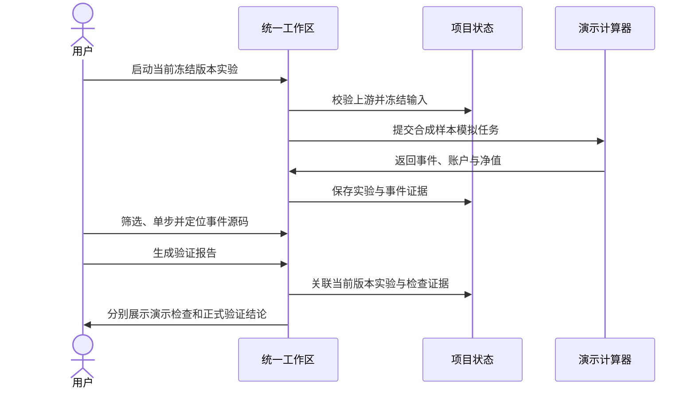

## MODIFIED — S19 调试到实验比较

# S19 调试到实验比较

## 实验、事件与验证

取消或模拟失败不增加实验；可重试。原始版本资金拒绝，修复版本默认收益6.25%。正式验证缺少真实数据、样本外和稳健性证据，不能显示通过。历史实验冻结输入不随修改变化。

本地原型动作不构成生产 API。正式接口须由后续运行时时序推导；本次无 API、DB、部署变更。对应检查见 core-S19-test-cases.md。
