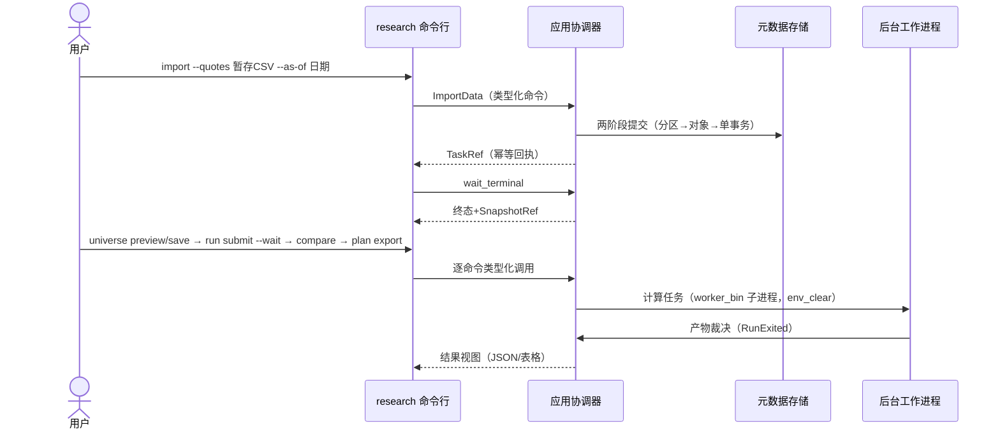

## ADDED — S21 CLI 研究链路

# S21 CLI 研究链路

## S21 CLI 研究链路

需求：FR-R 系列（core-08）与 FR-R13~R21（core-09）的命令行承载。前置：工作区目录可创建或已存在；数据导入凭证（TICKFLOW_API_KEY）只经数据导入子进程读取，CLI 进程不持有。CLI 是协调器库 API 之上的薄壳：参数解析 → 类型化命令 → JSON/表格输出，不新建线程模型、不复制业务语义。

### 场景时序

### 输入输出与后置条件
每个子命令对应既有协调器命令面：import（行情/主档/财务/公司行为/日历/规则暂存导入）、universe（preview/save）、run（submit 网格或单运行、--wait 等待终态、show 结果）、compare（2..5 运行交集比较）、plan（generate/export/note）。输出双形态：`--json` 机器可读与默认中文表格，两者字段同源。后置：工作区元数据与产物与库验收一致，CLI 不产生额外副作用（查询类命令零写入）。

### 失败与取消
非法参数以非零退出码输出中文用法，不触达协调器；业务拒绝（STALE_DATA、NO_OVERLAP、PATH_CONFLICT、IDEMPOTENCY_CONFLICT 等）透传错误码与定位字段，退出码 3；环境错误（工作区不可写、子进程启动失败）退出码 4，与 worker 契约对齐。run --wait 期间 Ctrl-C 或 cancel 子命令走 CancelTask：取消无已提交产物；已完成则返回 ALREADY_TERMINAL 与已有结果。凭证探针全链路不出现在 CLI 输出与日志。

## 退出码与输出契约

| 退出码 | 语义 | 示例 |
|---|---|---|
| 0 | 成功（含幂等回执返回原任务） | import 重复导入同键同哈希 |
| 3 | 业务拒绝（协调器错误码透传） | as_of 陈旧 STALE_DATA、可卖量校验失败 |
| 4 | 环境错误 | 工作区不可写、worker_bin 启动失败 |

其他参数：`--json` 输出结构化结果；`--workspace` 显式指定工作区（支持中文与空格路径）；查询类命令（list/preview/show/compare）只读，不写入元数据。
