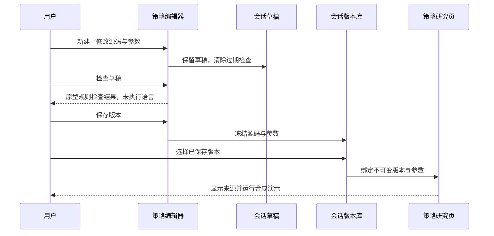

## ADDED — S16 策略开发工作区
新增FR-R12：用户可以从模板建立策略，编辑源码和参数定义，检查输入，保存不可变版本，并将指定版本送入策略研究。新增导航“策略开发”，置于股票池与策略研究之间；Rust GUI要求保持不变。本次是原型交互，具体策略语言按用户选择或明确披露的原型默认值展示，不因此改变已生效的Rust研究进程架构。

### 布局与交互
左侧策略库显示名称、模板、草稿状态和已保存版本数；中部为带行号的源码编辑区，提供源码／参数定义切换和新建、复制、下载操作；右侧显示入口说明、参数摘要和版本历史；底部输出检查步骤与定位信息。
草稿在本次页面会话中保留，切换导航或策略不会丢失；刷新原型会重置。新建要求名称非空且不重复，可从动量或等权模板开始；复制保留代码和参数，但产生独立策略身份。
原型检查只做必填入口、参数JSON及数值边界检查，输出明确写“原型检查通过，未执行策略语言”。修改源码或参数使检查立即过期，旧检查不得授权新草稿保存版本。
保存版本冻结名称、源码、参数及递增版本号；重复保存相同内容不产生空版本。版本历史查看只读；从历史恢复会建立新草稿而非覆盖旧版本。送入研究必须选中已保存且检查通过的版本，研究页显示版本号及来源。再次修改开发草稿不得改变已经绑定的研究版本。
研究按钮仍只运行原有合成曲线演示。自定义策略绑定后，内置模板参数控件不得伪装为自定义参数；明确展示绑定参数并提供“返回开发”入口，选择内置模板可解除绑定。

### 场景时序（原型内存动作，非生产API）

### 原型验收
| ID | 操作 | 预期 |
|---|---|---|
| UI-P07 | 打开开发页、新建及复制策略、编辑后切换页面 | 名称／源码／参数保留且不同策略相互独立 |
| UI-P08 | 删除入口或输入错误参数JSON，随后修正 | 显示原型检查失败原因；修正后通过但明确未执行语言 |
| UI-P09 | 检查后修改、保存版本、再次编辑、查看历史 | 修改后检查过期；旧版本只读且不被新草稿覆盖 |
| UI-P10 | 保存并送入研究，再修改开发草稿 | 研究绑定指定版本不变；自定义参数有正确来源且可返回开发 |
| UI-P11 | 导出源码、切换主题、1100和1440宽度 | 源码内容与草稿一致；编辑区可滚动，页面无横向溢出 |

### 生产实现边界
此HTML不使用eval、不启动语言解释器或编译器。未来真实策略执行需要另行补齐受控工作进程、超时／取消、依赖环境、输出契约、行情时点约束、版本存储、源码与运行哈希、真实编排测试。Python策略并非当前已实现的Rust worker功能；本原型不修改这一事实。

### 原型语言默认值
未收到语言偏好答复，本轮以Python编辑器示例完成原型。该选择只用于本次设计展示，不宣称用户已确认生产策略语言。
