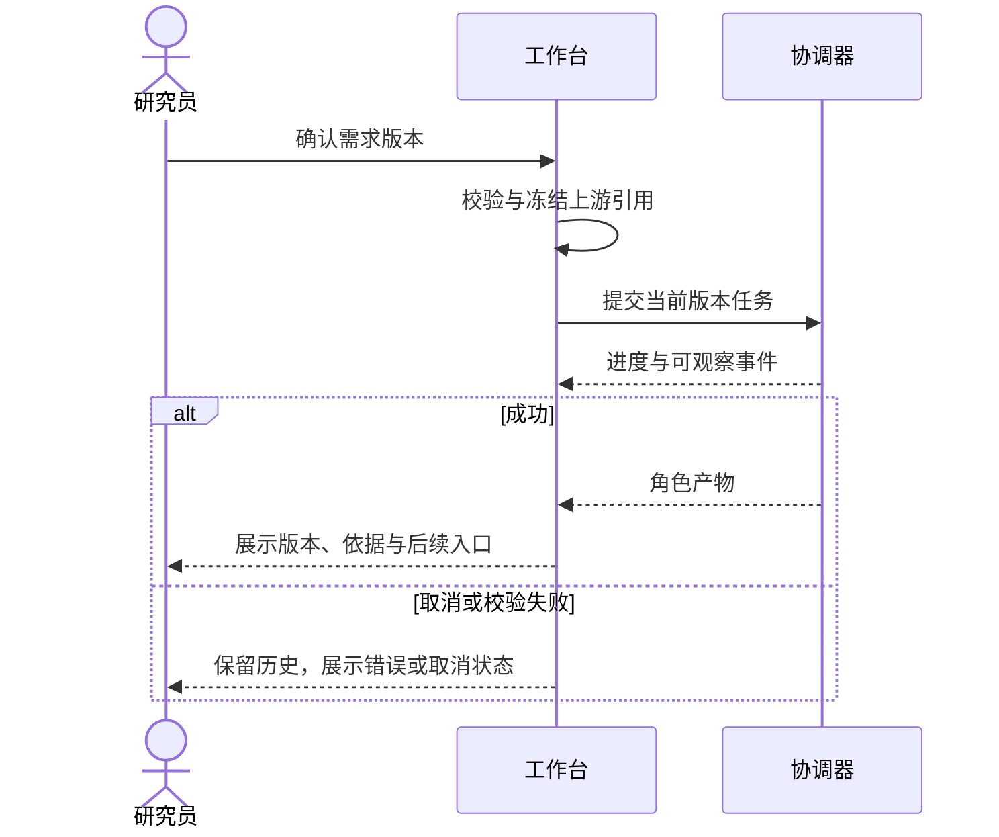

# S17 需求到协作产物

需求来源：core-09-ai-workspace-requirements.md；交互详见 core-05-ai-workspace-design.md。

本轮仅实现本地内存交互；无生产接口新增。过期输入不能启动新实验，已有结果仍可查看。测试见 core-S17-test-cases.md。

工程台重构后页面映射：需求页承载需求文档维护（正文、验收标准、结构化参数与版本历史），Agent 协作并入该页侧栏的协作记录。
