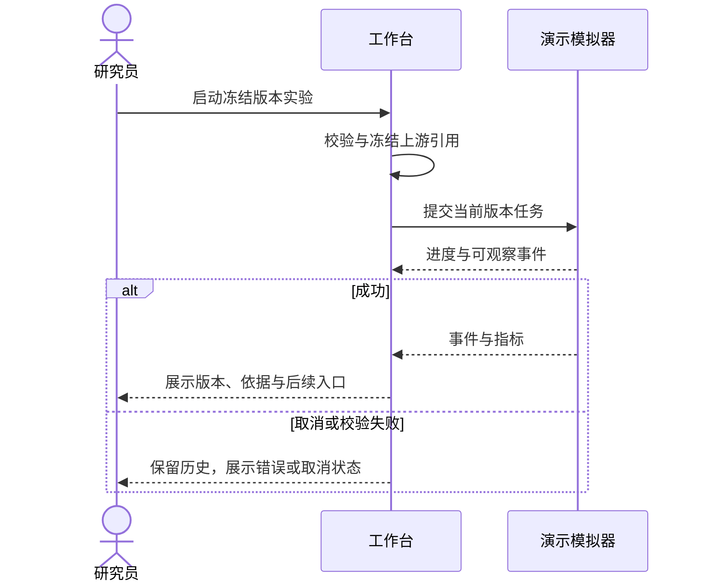

# S19 调试到实验比较

需求来源：core-09-ai-workspace-requirements.md；交互详见 core-05-ai-workspace-design.md。

```mermaid
sequenceDiagram
    actor U as 研究员
    participant G as 工作台
    participant W as 演示模拟器
    U->>G: 启动冻结版本实验
    G->>G: 校验与冻结上游引用
    G->>W: 提交当前版本任务
    W-->>G: 进度与可观察事件
    alt 成功
        W-->>G: 事件与指标
        G-->>U: 展示版本、依据与后续入口
    else 取消或校验失败
        G-->>U: 保留历史，展示错误或取消状态
    end
```

本轮仅实现本地内存交互；无生产接口新增。过期输入不能启动新实验，已有结果仍可查看。测试见 core-S19-test-cases.md。
