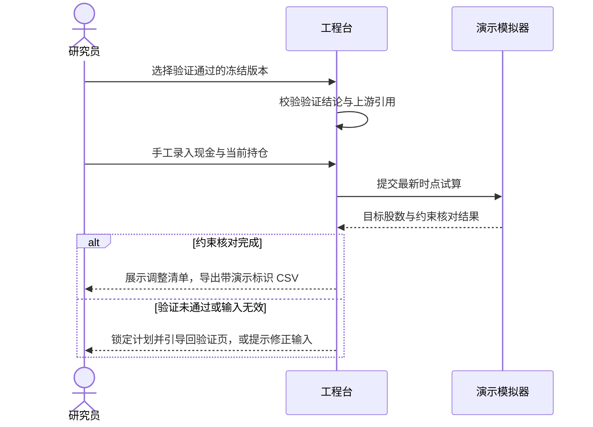

# S20 验证版本生成交易计划

需求来源：core-09-ai-workspace-requirements.md；交互详见 core-05-ai-workspace-design.md。

```mermaid
sequenceDiagram
    actor U as 研究员
    participant G as 工程台
    participant W as 演示模拟器
    U->>G: 选择验证通过的冻结版本
    G->>G: 校验验证结论与上游引用
    U->>G: 手工录入现金与当前持仓
    G->>W: 提交最新时点试算
    W-->>G: 目标股数与约束核对结果
    alt 约束核对完成
        G-->>U: 展示调整清单，导出带演示标识 CSV
    else 验证未通过或输入无效
        G-->>U: 锁定计划并引导回验证页，或提示修正输入
    end
```

交易计划是对最新一个时点的前向核对，不产生净值曲线，与回测不同；人工执行，不自动下单。本轮仅实现本地内存交互；无生产接口新增。测试见 core-S20-test-cases.md。
