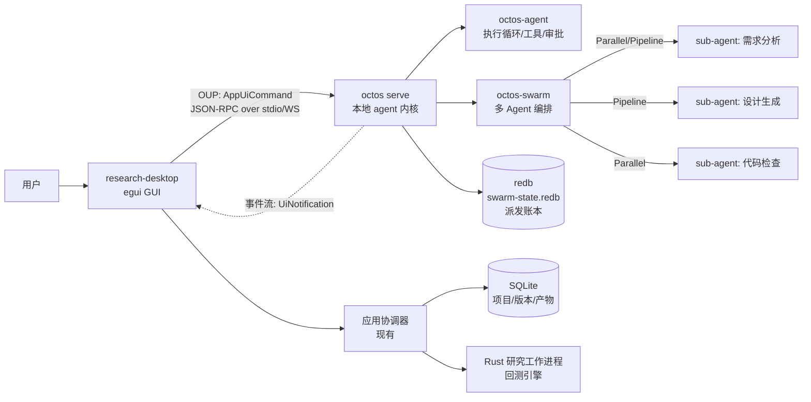
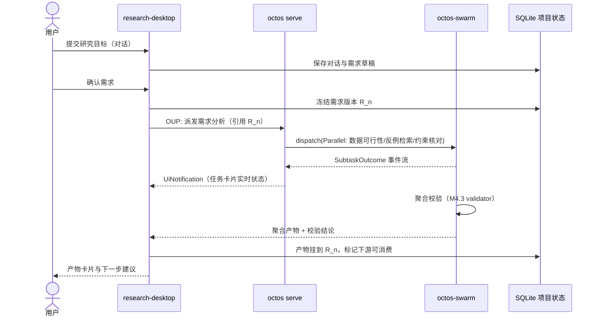

# 多 Agent 协作生产架构（core-06）

> 状态：设计草案 · 归属模块：core · 关联场景：S17（需求与多Agent协作）、S18（流程与开发）、S19（调试与实验）
> 本文回答一个问题：OpenLogos 原型（core-05）中的"后台多 Agent 协作"如何落地为生产实现。
> 结论：**不重新发明运行时**——以本地 octos 内核（octos-agent / octos-swarm）为底座，research-desktop 通过 OUP（Octos UI Protocol）接入。

## 1. 设计决策总览

| 决策点 | 选择 | 理由 |
|---|---|---|
| Agent 运行时 | **复用 octos 内核**（`octos serve` 进程） | octos 已提供 agent 执行循环、工具、审批、任务监督、持久化账本；原型中的"演示计算器"在生产中就是真实的 sub-agent dispatch |
| 多 Agent 编排 | **复用 octos-swarm** 的 `Swarm::dispatch` | 已具备 Parallel/Sequential/Pipeline/Fanout 四种拓扑、幂等派发、崩溃恢复、重试上限、聚合校验 |
| 接入方式 | **OUP over stdio / WebSocket**（参考 octoscode） | octoscode 的接线方式：GUI（TUI）不内嵌 agent，而是通过 `AppUiCommand`/JSON-RPC 与 `octos serve` 通信；research-desktop 作为另一个 OUP 客户端 |
| Agent 定义 | **AgentDefinition 清单**（JSON/TOML manifest） | 声明式能力包络：工具白/黑名单、模型偏好、生命周期钩子；与 Claude Code 的 AgentDefinition 字段对齐 |
| 状态持久化 | **redb 派发账本 + SQLite 项目元数据** | swarm 派发状态用 octos 自带 redb ledger（幂等恢复）；研究项目/版本/产物用 research-desktop 现有 SQLite |
| 前端呈现 | **隐藏编排细节**（延续 core-05 决策） | 用户不选角色、不配预算；只呈现任务状态卡片与产物引用 |

## 2. 运行时拓扑



**职责边界**（对齐 octoscode 的 client/server 划分）：

- **research-desktop（客户端）**：渲染、键盘/鼠标、本地视图状态、把用户意图翻译为 OUP 命令、展示任务卡片与产物引用
- **octos serve（服务端）**：session 管理、agent 执行、工具调用与沙箱、审批、swarm 派发与聚合、持久化账本
- **Rust 研究工作进程（不变）**：回测/筛选等计算任务——Agent 的"运行实验"动作最终以类型化消息发给现有协调器，**数值结果必须来自计算任务，不由 LLM 生成**（延续 core-05 的硬约束）

## 3. 场景映射：原型 → 生产

| 原型行为（core-05） | 生产实现 |
|---|---|
| 快捷提示"生成需求/设计/代码/实验/验证" | 对话意图路由（沿用 S17 的 11 预设意图）→ 映射为对应 `ContractSpec` 派发 |
| "正在分析需求/生成设计/运行检查"任务卡片 | swarm `SubtaskOutcome` 状态（queued/running/succeeded/failed/cancelled）经 OUP `UiNotification` 推送到 GUI |
| 取消 / 重试任务 | OUP 命令 → swarm dispatch 的取消语义；重试创建新 dispatch 并关联 `retry_of`（与协调器任务协议一致） |
| 预算字段（原型 #budget） | `SwarmBudget.max_contracts` + `max_retry_rounds`（上限 3 轮）；token 预算由 octos-agent 的 `budget.rs` 承载，**不向用户暴露** |
| "Agent 为预设产物"（演示数据） | 生产 Agent 产出 = 真实 sub-agent 产物 + 校验器结论；未经校验/未运行的产物不得标"通过" |
| 版本冻结/过期语义 | 不变，仍由 research-desktop SQLite 承担；Agent 产出写入前必须引用已冻结的需求/设计版本 ID |

### S17 需求与多 Agent 协作（生产时序）



**与原型的关键差异**：原型里 `startAgents` 是 setTimeout 模拟；生产中每个 subtask 是真实 dispatch，redb 账本保证崩溃后可恢复，聚合校验失败会阻断产物标记为可用。

## 4. Agent 定义清单（manifest）

在 `logos/agents/` 下放置声明式清单（schema 对齐 octos `AgentDefinition`，version=1）：

```toml
# logos/agents/requirement-analyst.toml
name = "requirement-analyst"
version = 1
tools = ["read_file", "grep", "glob", "web_search"]
disallowed_tools = ["shell", "write_file", "edit_file"]
model = "anthropic/claude-sonnet"
```

```toml
# logos/agents/design-generator.toml
name = "design-generator"
version = 1
tools = ["read_file", "write_file", "grep", "glob"]
disallowed_tools = ["shell"]
```

```toml
# logos/agents/code-reviewer.toml
name = "code-reviewer"
version = 1
tools = ["read_file", "grep", "glob", "shell"]  # shell 仅用于 cargo check / 预置检查脚本
```

| Agent | 职责 | 拓扑位置 |
|---|---|---|
| requirement-analyst | 需求可行性分析、反例检索、约束核对 | S17 Parallel 分支 |
| design-generator | 由确认需求生成设计草稿与流程图节点结构 | S18 Pipeline 头 |
| code-reviewer | 策略代码静态检查、预置示例比对 | S18 Pipeline 尾 |
| experiment-runner（薄封装） | 把"运行实验"翻译为协调器任务消息，**不自行计算** | S19 单契约 |

加载规则沿用 octos：目录扫描 + 内置默认 + 同名覆盖；`SpawnTool` 的 `agent_definition_id` 引用清单，内联字段优先。

## 5. 关键生产约束（继承自原型设计）

1. **数值结果必须来自计算任务**：experiment-runner 只发消息给协调器；LLM 不得生成回测数值（core-05 硬约束，不变）
2. **未确认需求不能生成设计**：dispatch 前校验上游冻结引用（`contracts_fingerprint` 类似物：需求版本哈希）
3. **任意源码不可冒称执行**：code-reviewer 只接受预置示例完整匹配才允许进入演示运行（S18 语义保留）
4. **正式验证恒需真实证据**：真实数据/样本外/稳健性缺失时报告必须显示"证据不足"（S19 语义保留）
5. **幂等与恢复**：所有 dispatch 携带 idempotency 键（dispatch_id + 契约指纹）；GUI 重启后从 redb 账本重建任务卡片状态
6. **项目隔离**：dispatch 的 `session_id` 绑定 research-desktop 项目 ID；切换项目不影响在途任务归属
7. **零新增 unsafe**：遵循 octos workspace `deny(unsafe_code)`

## 6. 落地批次建议

| 批次 | 内容 | 验收 |
|---|---|---|
| M1 | research-desktop 内嵌 OUP 客户端（stdio  spawn `octos serve`），单 Agent 对话通路 | 对话→需求草稿→SQLite 落库 |
| M2 | swarm Parallel 接入 S17（三并发分析 sub-agent），任务卡片实时状态 | ST-S17-16 全旅程（真实协调器） |
| M3 | Pipeline 接入 S18（设计→代码检查），版本冻结引用校验 | ST-S18 系列 |
| M4 | S19 实验派发与验证证据链；redb 崩溃恢复演练 | ST-S19 系列 + 中断恢复 |

每批次仍需走 OpenLogos 变更提案流程（change-writer → delta → verify），本文件为架构 delta 的输入，不直接授权实现。
