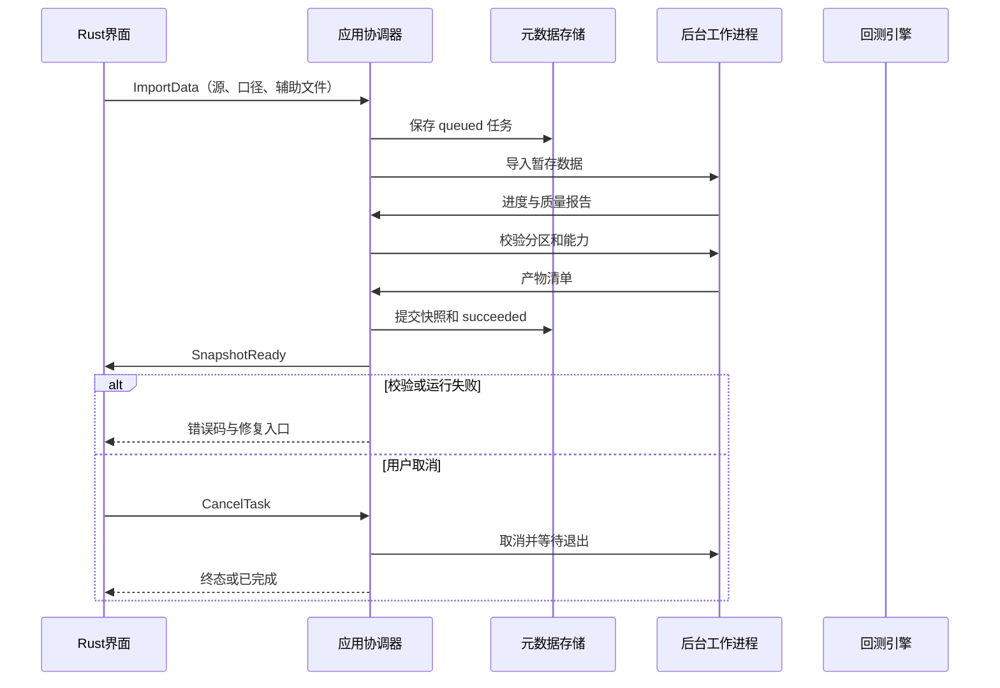
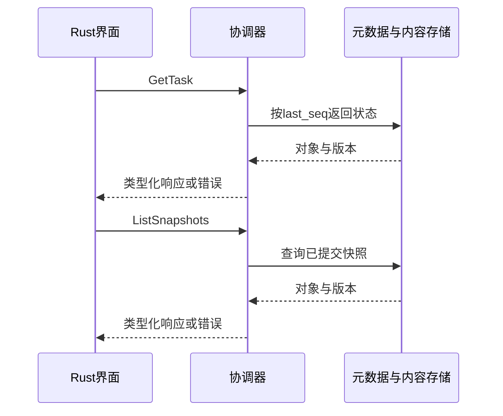

# S11 数据维护

## S11 数据维护

需求：FR-R01、FR-R02。前置：工作区已打开且持有写锁；所有引用版本存在。接口契约必须由下列消息推导。

### 场景时序

### 输入输出与后置条件
输入目录／源配置、价格口径、辅助数据；输出 snapshot_id、覆盖范围、质量与限制。重复导入相同内容复用内容哈希；冲突先保留报告再按同口径优先规则处理。

### 失败与取消
解析错误或磁盘不足→failed；网络失败允许保留原快照，不能把部分数据提交为完整快照；取消删除未提交暂存文件。
通用任务遵循架构状态机；写入只在最终提交后可见，页面切换不取消任务。CancelTask 只作用于尚未完成的后台任务，比较查询等同步操作返回前完成则返回 ALREADY_TERMINAL。

## 查询与保存子流程

