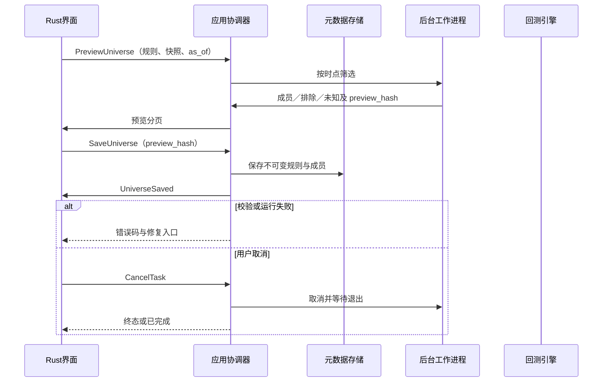
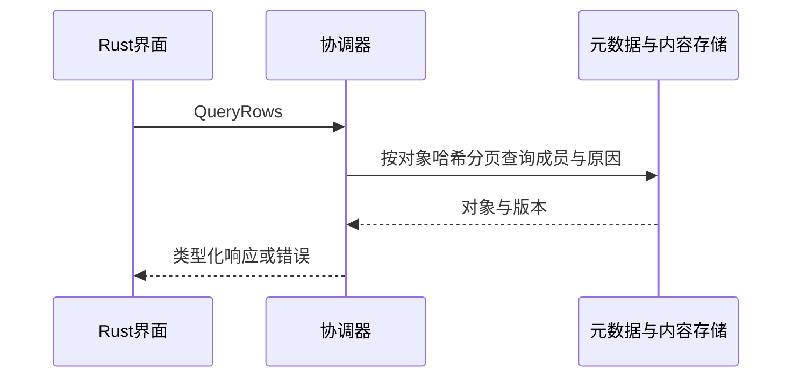

# S12 股票池筛选

## S12 股票池筛选

需求：FR-R03、FR-R04。前置：工作区已打开且持有写锁；所有引用版本存在。接口契约必须由下列消息推导。

### 场景时序

### 输入输出与后置条件
输入规则 AST、snapshot_id、as_of 和动态／固定模式；输出 preview_hash 及三态计数。保存必须匹配当前预览请求哈希；动态池保存规则版本，回测逐日重算，不能把本次预览成员套到过去。

### 失败与取消
公告时间缺失或历史主档缺失→严格预检拒绝；规则修改后保存旧预览→STALE_PREVIEW；空池可保存但回测拒绝。
通用任务遵循架构状态机；写入只在最终提交后可见，页面切换不取消任务。CancelTask 只作用于尚未完成的后台任务，比较查询等同步操作返回前完成则返回 ALREADY_TERMINAL。

## 查询与保存子流程

