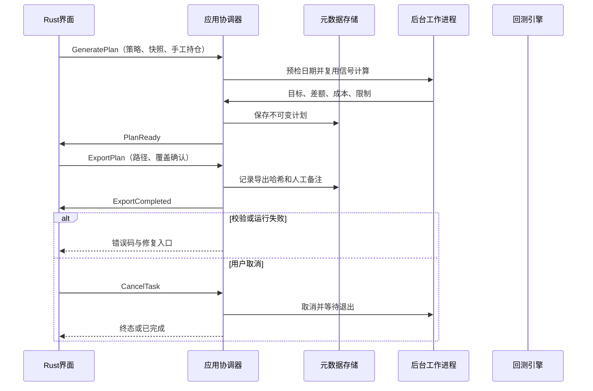
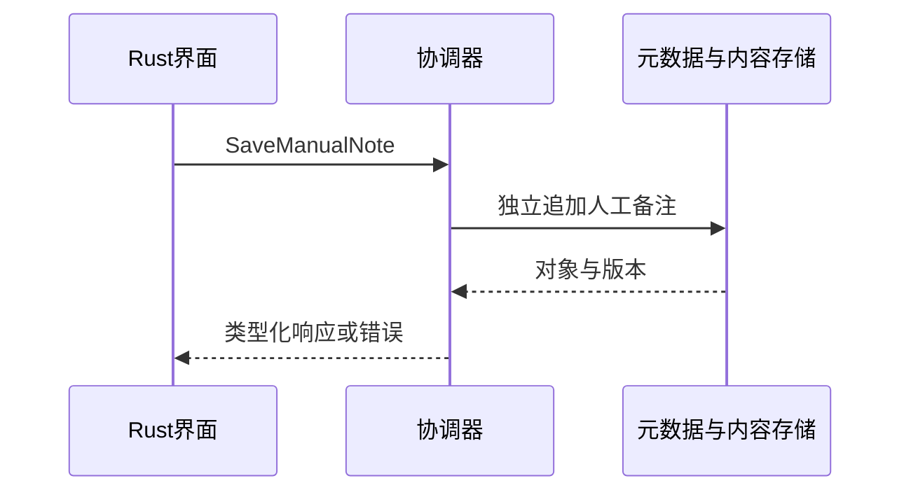

# S15 人工交易计划

## S15 人工交易计划

需求：FR-R09、FR-R11。前置：工作区已打开且持有写锁；所有引用版本存在。接口契约必须由下列消息推导。

### 场景时序

### 输入输出与后置条件
输入策略版本、as_of、snapshot_id和手工持仓版本；输出下一交易日参考计划。导出含数据来源、限制、版本、单位；手工执行记录独立于引擎成交。

### 失败与取消
日期陈旧需用户显式确认；可卖量>持仓拒绝；路径冲突未确认则拒绝覆盖；写入失败不损坏已有文件。
通用任务遵循架构状态机；写入只在最终提交后可见，页面切换不取消任务。CancelTask 只作用于尚未完成的后台任务，比较查询等同步操作返回前完成则返回 ALREADY_TERMINAL。

## 查询与保存子流程

