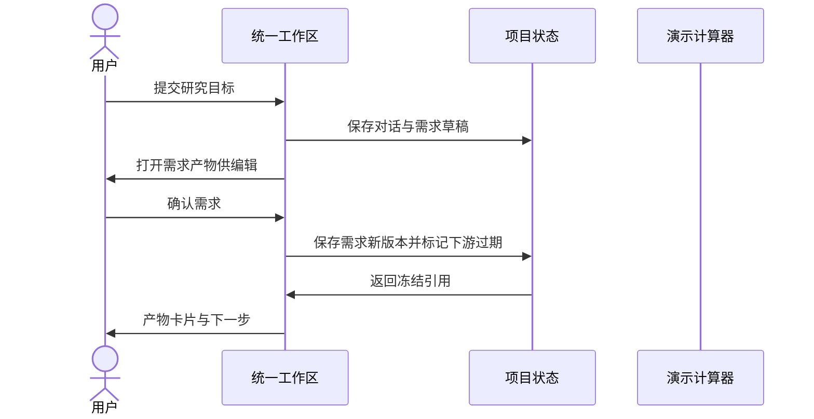

# S17 需求到协作产物

## 需求、对话与项目隔离

```mermaid
sequenceDiagram
    actor U as 用户
    participant G as 统一工作区
    participant P as 项目状态
    participant W as 演示计算器
    U->>G: 提交研究目标
    G->>P: 保存对话与需求草稿
    G->>U: 打开需求产物供编辑
    U->>G: 确认需求
    G->>P: 保存需求新版本并标记下游过期
    P->>G: 返回冻结引用
    G->>U: 产物卡片与下一步
```

输入为空或比例越界不提交。项目切换保存各自对话和草稿；后台任务绑定原项目，取消清除待提交任务。角色和预算不出现在主交互。

本地原型动作不构成生产 API。正式接口须由后续运行时时序推导；本次无 API、DB、部署变更。对应检查见 core-S17-test-cases.md。
