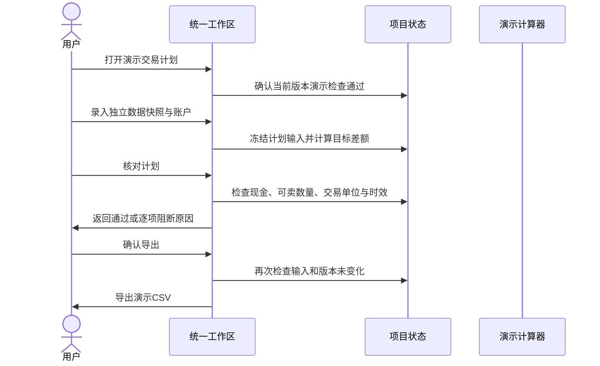

# S20 验证版本生成交易计划

## 计划生成、核对与导出

```mermaid
sequenceDiagram
    actor U as 用户
    participant G as 统一工作区
    participant P as 项目状态
    participant W as 演示计算器
    U->>G: 打开演示交易计划
    G->>P: 确认当前版本演示检查通过
    U->>G: 录入独立数据快照与账户
    G->>P: 冻结计划输入并计算目标差额
    U->>G: 核对计划
    G->>P: 检查现金、可卖数量、交易单位与时效
    G->>U: 返回通过或逐项阻断原因
    U->>G: 确认导出
    G->>P: 再次检查输入和版本未变化
    G->>U: 导出演示CSV
```

账户、快照、版本或上游参数改变立即使核对失效；可卖不足、现金不足、数据过期阻止导出。计划估值基于独立合成快照，不冒称最新真实行情。

本地原型动作不构成生产 API。正式接口须由后续运行时时序推导；本次无 API、DB、部署变更。对应检查见 core-S20-test-cases.md。
